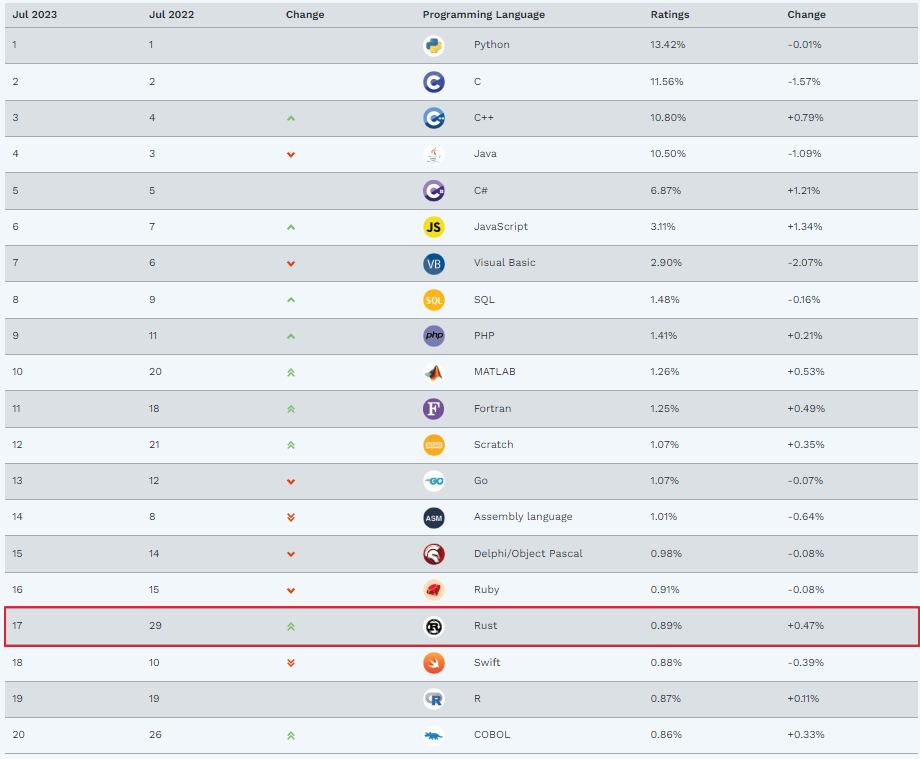
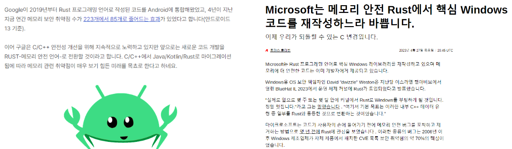

# **cheese cRust** 
## 가짜연구소 Rust 스터디 OT


---

# Hello World
```rust
fn main() {
    println!("Hello World");
}
```
Rust 입문을 환영합니다

---

# 빌더 소개

- 게임 회사 게임 개발자로 시작
- 자동화 업무 + @ 잡다하게 다하는 프로그래머
- 주력 언어는 C++, Python
- 6기 CPython 파헤치기 빌더

---

# 스터디 목표

- 빠른 Rust 언어의 기본기 학습
- 간단한 ML 모델 만들어보기
- 웹 서버 만들어서 내가 만든 모델 추론하기

---

# 스터디 진행 방식
- 매주 목요일 22:00~23:00 (1시간)
- 각자 공부한 내용을 정리
- 발표자 인원수에 따라 랜덤으로 뽑아서 자료와 함께 공부한 내용 발표
- 그 외에 인원은 간단하게 공부한 내용 가볍게 이야기
- 주마다 숙제 디스코드 채널에 공유

---

# Rust 소개

---

-  Mozila 재단에서 시작, 현재는 Rust 재단에서 개발 및 배포를 담당하고 있는 언어
-  리눅스 커널에서 사용할 수 있는 2번째 언어 (첫번째는 C)

---




---

# Rust 활용 사례

---



Google은 Android OS내 Rust 도입, 보안 취약점 해결
MS에서도 제품내 일부 코드를 Rust로 대체 중


---

# 개발 환경 세팅

Visual Studio Code
Rust
LLDB (Debugger)

---

# 공부할 예정인 Rust만의 특징

표현식 기반 언어
메모리 소유권과 참조
동시성
