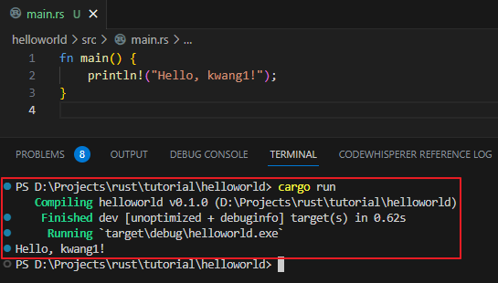

# **cheese cRust** 
## 가짜연구소 Rust 스터디 OT
 

---

# Hello World
```rust
fn main() {
    println!("Hello World");
}
```
Rust 입문을 환영합니다

---


계획표 잘 확인하여 지원해주셔서 감사합니다

---

# 빌더 소개

- 게임 회사에서 게임 빼고 다 다하는 프로그래머
- 자동화 업무 + @
- 주력 언어는 C++, Python
- 가짜연구소 6기 CPython 파헤치기 빌더

---

# 스터디 목표

- 빠른 Rust 언어의 기본기 학습
- 간단한 ML 모델 만들어보기
- 웹 서버 만들어서 내가 만든 모델 추론하기
- 학습한 내용을 베이스로 오픈 소스 기여

---

# 스터디 진행 방식

---

- 매주 목요일 22:00~23:00 (1시간)
- 각자 공부한 내용을 정리 
- PPT, Notion, Github Page 등 자유

---

- 발표자 랜덤으로 3명 뽑아서 정리한 내용 발표
- 발표자 외에는 간단하게 공부한 내용 이야기
- 발표자는 2주간 랜덤에서 제외

---

- 주마다 숙제 디스코드 채널에 스샷으로 공유

---

# Rust 소개

---

-  Mozila 재단에서 시작, 현재는 Rust 재단에서 개발 및 배포를 담당하고 있는 언어
-  리눅스 커널에서 사용할 수 있는 2번째 언어 (첫번째는 C)

---


---

# Rust 활용 사례

---


Google은 Android OS내 Rust 도입, 보안 취약점 해결
MS에서도 제품내 일부 코드를 Rust로 대체 중

---

# 개발 환경 세팅

rustup (Rust)
Visual Studio Code (IDE)
VSCode C/C++ or CodeLLDB (Debugger)

---


https://www.rust-lang.org/learn/get-started
1. Rust 홈페이지에서 Getting started
2. 운영체제 맞는 rustup 설치

---


Visual Studio Code에서 rust analyzer 설치
Rust의 Intellisense 등 지원해주는 플러그인

---


Rust 디버깅을 위한 C/C++ 또는 CodeLLDB 플러그인 

---

# 공부할 예정인 Rust만의 특징

표현식 기반 언어
메모리 소유권과 참조
열거형과 패턴 매칭
제네릭, 트레이트, 라이프타임
동시성

---

# 교제 및 참고자료

---


https://rust-kr.github.io/doc.rust-kr.org/title-page.html
공식 가이드북 한글 번역

---


https://learn.microsoft.com/ko-kr/training/paths/rust-first-steps/
마이크로 소프트 Rust 학습 페이지

---

# 금주의 미션

---


Rust 개발 환경 세팅
Hello, [닉네임 or 이름]!
출력하여 디스코드에 공유

---


**치즈크러스트처럼 쭉쭉 늘어나게 성장해봅시다**