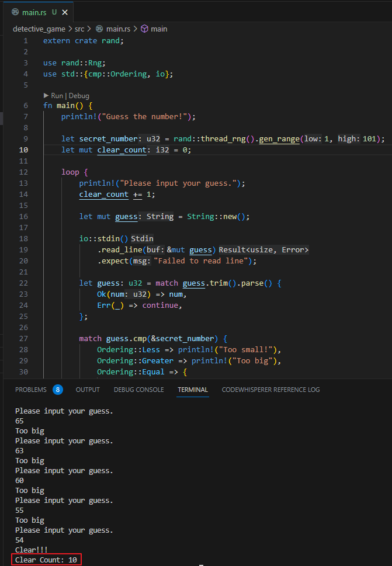

# **cheese cRust** 
# 가짜연구소 Rust 1주차
시작하기, 추리 게임, 보편적인 프로그래밍
 

---

# rustup
- 러스트 설치 도구
- https://www.rust-lang.org/ 에서 Windows는 exe 설치
- Linux, Mac은 별도의 Command를 통하여 설치
- C/C++ 컴파일 도구 필요 (Windows는 MSVC)

---

## 버전 확인
```shell
rustc --version
```
---

## 업데이트 및 삭제
```shell
rustup update           // 업데이트
rustup self uninstall   // 삭제
```

---

# Hello, World!
```rust
fn main() {
    println!("Hello, World!");
}
```
main.rs

---

## main.rs 컴파일 하기
```
rustc main.rs
```
컴파일 결과로 main.exe 생성

---

## Hello, World 프로그램 뜯어보기

---

```rust
fn main() {

}
```
- fn은 함수 선언
- 대부분 언어와 동일하게 main이 진입점

---

```rust
println!("Hello, World!");
```
- println!는 러스트에서 사용하는 **매크로**
- 문자열을 Console Output에 찍어주는 매크로
- 추후 다룰 내용이지만 총 3가지 종류의 매크로가 있음
- 다른 코드를 작성하는 코드를 작성하는 방법, **메타 프로그래밍**이라고 함

---

# Cargo
- Rust의 빌드 시스템 및 패키지 매니저
- 코드 빌드
- 외부 라이브러리 설치 (pip, npm 같은 도구)
- 라이브러리 제작 간편화 등

---

## Cargo로 프로젝트 생성
```shell
cargo new [프로젝트명]
```
위 명령어로 프로젝트를 생성하면 현재 폴더 하위에 
[프로젝트명] 폴더 생성 후 프로젝트 생성

---

```shell
cargo init
```
현재 폴더에 프로젝트 생성

---

## Cargo.toml
- cargo 설정에 사용하는 포맷
- [package]: 헤더, 패키지 설명 구문
- [dependencies]: 프로젝트 의존성 목록

---

## Cargo 빌드 관련 명령어
```shell
cargo build     // 프로젝트 빌드
cargo run       // 프로젝트 빌드 및 실행
cargo check     // 프로젝트 에러 체크
```

---

# 숫자 추리 게임

간단한 문법 활용, 랜덤 생성되는 숫자를 추리하는 게임

---

## 주요 활용 문법
- mut 키워드: Rust의 기본은 불변, 가변 변수 키워드
- io::stdin().read_line(): 표준 입력 라이브러리
- println! 자리 표시자 값 출력

---

## 크레이트 (Crate)
- 크레이트는 러스트의 패키지
- 현재 프로젝트에서는 rand 패키지 사용
- Cargo.toml의 [dependencies]에 직접 추가해도 됨
- cargo add rand 통해서 추가 가능
- Crates.io 에서 패키지를 가져옴

---

## Cargo.lock
- 프로젝트 상태를 재현 가능하도록 패키지 버전 기록
- 빌드할 때 기록하여 추후 빌드시 Cargo.lock을 확인
- 자세한 내용은 추후 더 다룰 예정

---

## rand를 사용하여 숫자 생성
```rust
use rand::Rng;

fn main() {
    ...
    let secret_number = rand::thread_rng().gen_range(1..=100);
    ...
}
```
- 1부터 100 포함 랜덤 숫자를 생성하는 코드
- **Rng**: Random Number Generator
- **thread_rng**: 스레드 로컬에 대한 난수 생성기

---
## 난수와 입력 숫자 비교
```rust
match guess.cmp(&secret_number) {
    Ordering::Less => println!("Too small!"),
    Ordering::Greater => println!("Too big!"),
    Ordering::Equal => {
        println!("You win!");
        break;
    }
}
```
- u32 타입의 cmp 메서드 사용
- 결과값인 Ordering enum 값을 match 사용하여 검사
- 검사 결과에 따라 처리

---

## 입력 받은 숫자도 match 처리
```rust
let guess: u32 = match guess.trim().parse() {
    Ok(num) => num,
    Err(_) => continue,
};
```
- parse 결과로 Result enum을 받음
- Ok 일때 처리와 Err 일 때 처리를 분리

---

## 반복문 loop
```rust
loop {
    // (반복되는 작업들)
}
```

---

# 일반적인 프로그래밍 개념

---

## 변수와 가변성

```rust
fn main() {
    let x = 5;
    x = 6;      // 컴파일 에러
}
```
러스트의 변수는 기본적으로 불변성 (immutable)


---

```rust
fn main() {
    let mut x = 5;
    x = 6;      // 컴파일 OK
}
```
mut 키워드를 추가하여 가변으로 만들 수 있음

---

## 상수

```rust
const THREE_HOURS_IN_SECONDS: u32 = 60 * 60 * 3;
```
- mut 키워드 불가능
- let 대신 const로 선언
- 값의 타입 명시 필수
- 런타임에 계산될 수 있는 결과값은 사용 불가능 
(컴파일 타임 평가)
- 이름 규칙은 대문자 + 밑줄(_)
- 프로그램이 동작하는 동안 유효
- [자세한 내용 링크](https://doc.rust-lang.org/reference/const_eval.html)

---

## 섀도잉
```rust
fn main() {
    let x = 5;
    let x = x + 1;
    {
        let x = String::from("Another Type Shadowing");
    }
}
```
- 이미 선언된 변수를 재사용 할 수 있음
- let 키워드를 통하여 해당 변수를 재선언
- 기존 타입과 무관하게 가능
- C/C++에서는 있을 수 없는 일... Python은 가능

---

## 데이터 타입
```rust
let guess: u32 = "42".parse().expect("Not a number!");
```
- 러스트는 정적 타입 언어
- 컴파일 타임에 모든 타입은 정해져 있어야한다
- String의 parse 메서드는 여러 타입 반환이 가능
- 위와 같이 명시하지 않으면 컴파일 에러

---

## 스칼라 타입

```
i8, u8, i16, u16, i32, u32
i64, u64, i128, u128, isize, usize
```

- i (signed), u(unsigned) 타입
- isize, usize의 경우 컴퓨터 환경에 따라 32, 64bit
- 시각적 구분을 위한 언더바(_) 사용 가능 
(1000 == 1_000)

---

## 정수 오버플로우
- 디버그 모드에서는 에러 발생
- 릴리즈 모드에서는 2의 보수 감싸기 수행 u8의 256은 0이됨

---

## 부동 소수점 타입

```rust
let x = 2.0         // f64
let y: f32 = 3.0    // f32
```
- f32, f64 두가지 존재, 정밀도 차이
- C/C++의 float과 double의 차이

---

## 수치 연산

```rust
let sum = 5 + 10;               // 덧셈
let difference = 95.5 - 4.3;    // 뺄셈
let product = 4 * 30;           // 곱셈
let quotient = 56.7 / 32.2;     // 나눗셈
let truncated = -5 / 3;         // 나눗셈2 (결과 -1)
let remainder = 43 % 5;         // 나머지 연산
```

---

## boolean 타입

```rust
let t = true;
let f: bool = false; 
```
- 다른 언얻와 동일하게 true, false 두 값을 가질 수 있음
- 1바이트 크기
- 조건식에 사용

---

## 문자 타입

```rust
let c = 'z';
let z: char = 'ℤ'; 
let heart_eye_cat = '😻';
```
- 기본적인 문자 타입 char
- 문자열은 큰따옴표("), 문자는 작은따옴표(') 사용
- 러스트의 char는 4바이트
- 유니코드 스칼라값 표현, ASCII보다 많은 값 표현
- 한/중/일, 이모지, 넓이 0인 공백 문자 모두 유효

---

## 복합 타입
여러 값을 하나의 타입으로 묶을 수 있는 타입
튜플(tuple)과 배열(array) 두 가지가 존재

---

## 튜플

```rust
let tup: (i32, f64, u8) = (500, 6.4, 1);
let (x, y, z) = tup;
```
- 다양한 타입 값을 묶어 하나의 복합 타입을 만드는 방법
- 한 번 선언되면 줄이거나 늘릴 수 없음
- 두 번쨰 줄과 같이 구조 해제 가능
- Python의 튜플과 유사 (패킹, 언패킹)

---

## 배열 타입

```rust
let a = [1, 2, 3, 4, 5];
let first = a[0];
let second = a[1];
let b[i32; 5] = [1, 2, 3, 4, 5];    // 명시적 배열 타입 선언
let failed = b[5];                  // 런타임 에러 발생
```
- 한가지 타입의 여러값을 집합체로 만드는 배열
- 모두 같은 타입이어야함
- 대괄호 안에 쉼표로 구분한 값을 나열해서 만듬
- 대괄호를 통하여 접근
- 배열 끝을 넘어서는 접근은 런타임 에러

---

# 함수

```rust
fn main() {
    ...
}

fn another_function() {
    ...
}
```
- 러스트는 함수나 변수 이름을 스네이크 케이스 방식 이용
소문자 + 언더바(_) 조합
- fn 으로 시작
- 중괄호를 사용하여 함수의 시작과 끝을 표현

---

## 매개변수

```rust
fn another_function(x: i32) {
    ...
}
```

- 함수는 매개변수를 가질 수 있다
- 함수를 호출할 때 넘기는 값 인수
- 타입 명시 필수

---

## 구문과 표현식

- 함수 본문은 필요에 따라 표현식(expression)으로 끝나는 구문(statement)의 나열로 구성
- 러스트는 표현식 기반 언어

---

```rust
fn main() {
    let y = 6;
}
```
- let 키워드로 변수를 만들고 값을 할당하는 것은 구문
- let y = 6; 은 구문
- 구문은 값을 반환하지 않는다

---

```rust
let x = (let y = 6);  // error
```
- 값을 반환하지 않기에 let 구문을 다른 변수에 할당하려고 하면 에러 발생
- C/C++이였다면 int x = y = 6; 과 같이 작성했을 것이지만 rust는 허용 X

---

```rust
let y = {
    let x = 3;
    x + 1       // 이 라인의 결과가 반환됨
};
```

- 위 코드의 중괄호로 만든 스코프는 표현식
- **러스트에서 작성하는건 대부분 표현식**
- let x = 3; 라인에서 숫자 3은 표현식
- **표현식은 종결을 나타내는 세미콜론(;) 사용 X**

---

## 반환 값을 갖는 함수
```rust
fn five() -> i32 {
    5
}
```

- 반환 값을 명명할 필요는 없음, 타입은 화살표(->) 뒤에 선언 해야함
- return 키워드로 함수 도중에 나갈 수 있음
- 대부분 함수는 암묵적으로 마지막 표현식 값을 반환
- 위 코드 숫자 5 뒤에 세미콜론이 들어가면 에러 발생

---

## 주석

```rust
// 주석입니다
```

- 기본적인 주석은 // 뒤에 작성
- 문서화 주석이 존재하는데 추후에 다룸 (python의 docstring 같은?)

---

## 제어 흐름문 if

```rust
if num < 5 {
    println!("num 은 5미만");
} else if num < 10 {
    println!("num 은 5 이상 10미만");
} else {
    println!("num 은 10 이상");
}
```

- 다른 언어와 동일하게 if 뒤에 조건
- C/C++과 달리 조건문에 괄호는 쓰지 않음
- else if, else 사용은 동일
- bool 타입을 넣지 않으면 에러가 발생
(Python은 다 넣을 수 있다...)

---

## let 구문에서 if

```rust
let condition = true;
let num = if condition { 5 } else { 6 };
```

- 다른 언어의 3항 연산자 비슷?
- condition이 true 이기에 num은 5
- 각각 다른 타입을 반환받을 수 없다 (컴파일 에러발생)

---

## 반복문을 이용한 반복
loop, while, for

---

## loop

```rust
loop {
    (반복될 코드)
}
```
- 아무 조건 없는 반복문
- 다른 언어였으면 보통 while(true)로 사용했을 것
- 다른 언어와 동일하게 continue로 다름 루프로 건너뛸 수 있고, break 문으로 빠져나올 수 있다

---

## 반복문에서 값 반환

```rust
let mut counter = 0;

let result = loop {
    counter += 1;

    if counter == 10 {
        break counter * 2;
    }
};
```

- break 표현식 뒤에 반환할 값을 넣으면 반환
- counter가 10이 되면 counter * 2를 반환하는 코드

---

## loop 라벨로 여러 반복문 사이 모호함 제거

---

```rust
let mut count = 0;
'counting_up: loop {
    println!("count = {count}");
    let mut remaining = 10;

    loop {
        println!("remaining = {remaining}");
        if remaining == 9 {
            break;
        }
        if count == 2 {
            break 'counting_up;
        }
        remaining -= 1;
    }
    count += 1;
}
```

'counting_up 라벨을 바깥 루프에 적용, 안쪽 loop에서 
바깥 'counting_up: loop를 break 할 수 있다!!!

---

# while

```rust
while number != 0 {
    println!("{number}!");
    number -= 1;
}
```

- 조건이 true인 동안 반복되는 반복문

---

# for

```rust
let a = [10, 20, 30, 40, 50];
for element in a {
    println!("the value is: {element}");
}
```

- for로 배열 등 컬렉션을 순회 돌 수 있음

---

```rust
for num in 1..4 {
    println!("the value is: {num}");
}
```

- 1..4는 Range 타입
- 1~3까지 반복
- 4까지 하고싶다면 1..=4

---

```rust
for num in (1..4).rev() {
    println!("the value is: {num}");
}
```

- Range 객체의 기능을 사용하고 싶다면 괄호로 감싸서 사용
- rev는 reverse, 3~1까지 역순으로 출력

---

# 1주차 미션

---


- 숫자 추리 게임에서 몇 번만에 풀었는지 결과 출력 
**(필수 미션)**

---


- [백준 2747번 피보나치 수](https://www.acmicpc.net/problem/2747) Rust로 풀고 내 제출 결과 공유 
**(선택 미션)**