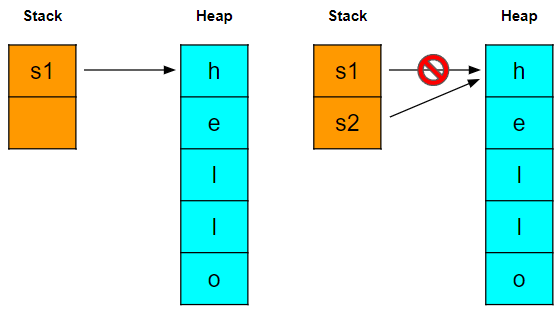
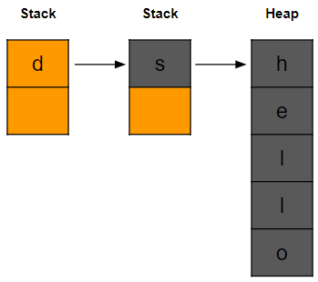
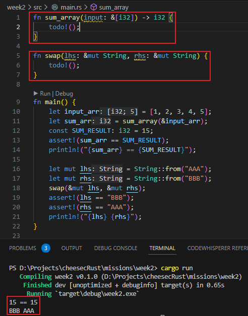

<style>
{
    font-size: 30px
}
</style>

# **cheese cRust** 
# 가짜연구소 Rust 2주차
소유권 이해하기
 

---

# 소유권?
- 러스트의 가장 독특한 특징
- 메모리 관리 방법
- 가비지 컬렉션 없이 메모리 안정성 보장

---

## 소유권 규칙
- 각각 값은 소유자(Owner)가 정해져 있다
- 한 값의 소유자는 여럿 존재할 수 없다
- 소유자가 스코프 밖으로 벗어날 때 값은 버려진다

---

## 변수 스코프

```rust
{                       // s 선언 전, 유효하지 않음             
    let s = "hello";    // s 유효
    // s로 작업
}                       // 스코프 종료, s는 유효하지 않음
```
- 스코프는 C/C++와 동일하게 스코프 내에서만 유효

---

## String 타입

```rust
let s = String::from("hello");
let mut s = String::from("hello");
```
- 문자열 리터럴은 불변
- String 사용하여 변경도 가능
- 문자열 리터럴을 String::from 을 통하여 할당 가능
- from 내부에서 리터럴에 대한 사이즈만큼 할당함
- 힙을 사용하기에 가능

---

# 메모리와 할당

```rust
{
    let s = String::from("hello");  // s 유효
    // s로 작업
}   // 스코프 종료, s 무효                      
```

- String를 사용하면 실행 중 메모리 할당 요청 필요
- 사용 완료 후 해제할 방법 필요
- Rust에는 GC가 없지만 스코프를 벗어나면 해제
- 해제될 때 내부의 drop를 호출

---

```C++
class Wrapper {
    Wrapper::Wrapper() { this.a = new int; }
    Wrapper::~Wrapper() { delete this.a; }
}

{
    Wrapper wrapper;
}

```

- 비슷한 기법으로 C++ 쪽엔 Effective C++에 소개됨
- RAII 패턴

---

## 변수 데이터 상호작용: Move

```rust
let x = 5;
let y = x;
```

- x에 값 5로 선언
- y에 x를 복사 대입
- x, y 둘 다 유효
- 정수형은 값 크기가 정해진 단순한 값이기에 가능

---

```rust
let s1 = String::from("hello");
let s2 = s1;
```

- s1 선언
- s2 로 s1의 값만 이동되고 s1 무효

---



- s1 선언시 스택에 s1 변수가 생성되고 힙에 문자열 할당
- s2 선언 후 스택에 할당하고 s1 대입
- s1 과 힙의 문자열은 연결이 끊기고
- s2 가 해당 문자열을 가리키게 됨
- 고로 s1은 더이상 의미가 없는 변수가 됨
- 이동 연산이라고 함

---

## 변수 데이터 상호작용: Clone

```rust
let s1 = String::from("hello");
let s2 = s1.clone();
```

- clone 메서드를 사용하면 힙의 내용을 복사 (깊은 복사)
- s1, s2 둘다 유효

---

## 변수 데이터 상호작용: Copy

```rust
let x = 5;
let y = x;
```

- 컴파일 타임에 크기가 고정된 타입만 복사 동작
- 모든 정수형, bool, 부동 소수점, 문자 타입(char)
- Copy 가능한 타입만으로 구성된 tuple

---

## 소유권과 함수

<style scoped>
{
    font-size: 30px
}
</style>

```rust
fn takes_ownership(some_string: String) { // move되어 넘어온 some_string
    ...
} // some_string는 스코프 밖으로 가서 drop 호출

fn makes_copy(some_int: i32) { // copy되어 넘어온 some_int
    ...
} // 인자 some_int는 해제
```

```rust
let s = String::from("hello");
takes_ownership(s);             // s는 함수로 이동되어 무효
let x = 5;
makes_copy(x);                  // x는 함수로 복사, 여전히 유효
```

---

## 반환값과 스코프

```rust
fn give_ownership() { 
    let some_string = String::from("yours");
    some_string  // some_string 반환, 호출자 함수쪽으로 이동
} 

fn takes_and_gives_back(some_string: String) {  // move되어 넘어온 some_string
    some_string  // some_string 반환, 호출자 함수쪽으로 이동
} 
```

```rust
let s1 = give_ownership();  // 반환값을 s1으로 이동
let s2 = String::from("hello");
let s3 = takes_and_gives_back(s2);  // s2는 함수로 이동하여 무효, 반환 값은 s3로 이동
```

---

# 참조와 대여

```rust
fn calculate_length(s: &String) -> usize { 
    s.len()
} 
```

```rust
let s1 = String::from("hello");
let len = calculate_length(&s1);
```

- & 연산을 사용하여 소유권을 가져오지 않고 해당 값을 참조할 수 있다

---


- 그림으로 보면 s는 s1을 참조만 하여 사용이 가능한 것
- 이와 같이 & 연산으로 참조자를 만드는 행위를 **대여(brrow)** 라고 함
- 현재는 참조 값을 바꿀 수 없음

---

## 가변 참조자

```rust
fn change(s: &mut String) { 
    s.push_str(" world");
} 
```

```rust
let mut s1 = String::from("hello");
change(&mut s1);  // s1 = "hello world"
```

- s1을 mut로 변경
- 가변 참조자 (&mut)를 인자로 받아서 s1을 수정 가능

---

```rust
let mut s1 = String::from("hello");
let r1 = &mut s1;
let r2 = &mut s1;  // 컴파일 에러!
```

- 가변 참조자는 제약 사항으로 하나만 만들 수 있다

---

```rust
let mut s1 = String::from("hello");
let r1 = &s1;
let r2 = &s1;
let r3 = &mut s1;  // 컴파일 에러!
```

- 불변 참조자와 혼용할 때에도 유사 규칙 적용
- 단순 참조는 여러번 가능하다
- 이미 어떠한 참조가 되어있다면 가변 참조자는 만들 수 없다


---

```rust
let mut s = String::from("hello");
let r1 = &s;
let r2 = &s;
println!("{r1} {r2}");  // 여기서 r1, r2 무효

let r3 = &mut s;        // 참조가 없기에 r3 가변 참조 가능
println!("{r3}");
```

- 위와 같은 상황에서 r1, r2가 선언 후 사용되어 무효화되고 r3 선언 가능

---

## 댕글링 참조

```rust
fn dangle() -> &String {
    let s = String::from("hello");
    &s
}
```

```rust
let d = dangle(); // 에러 발생
```

- dangle 내부에서 String 생성 후 레퍼런스로 반환
- s가 스코프 밖으로 가면서 해제됨
- dangling는 s의 레퍼런스를 받았지만 이미 해제되어있음

---



- 위 그림과 같이 d는 s를 참조한다
- s는 이미 해제되었기에 빈 메모리인 상태이고 그곳을 참조하기에 문제
- 취약점

---

# 슬라이스

컬렉션(문자열, 배열 등)을 연속된 일부 요소를 참조하도록 해주는 기능

---

## 문자열 슬라이스

```rust
let s = String::from("hello world");
let hello = &s[0..5];   // hello
let world = &s[6..11];  // world
```

- [start..end] start 부터 end 전까지 슬라이스를 생성

---

```rust
let s = String::from("hello world");
let hello = &s[0..5];   // hello
let hello2 = &s[..5];   // hello
```

- 0부터 시작하는 경우 앞을 생략 가능

---

```rust
let s = String::from("hello world");
let len = s.len();
let world = &s[6..len]; // world
let world = &s[6..];    // world
```

- 맨 마지막 바이트까지 포함하는 경우 뒤는 생략 가능
- 문자열 슬라이스 타입은 **&str**

---

```rust
fn func(s: &str) -> &str { 
    ... 
}
```

```rust
let s = String::from("hello world");
func(&s);
```

- 위와 같이 문자열 슬라이스 타입에 &String을 바로 전달 가능
- 이러한 유연성은 역참조 강제 기능 (추후 다룰 예정)

---

```rust
let a = [1, 2, 3, 4, 5];
let slice = &a[1..3];  // [2, 3]
```

- 문자열 슬라이스는 문자열 한정
- 위 배열과 같이 범용적 슬라이스 타입도 존재
- &[i32] 타입

---

# 2주차 미션

---



- [저장소의 missions/week2/main.rs 완성하기](https://github.com/4roring/cheese-cRust/tree/master/missions/week2/main.rs)
**(필수 미션)**
