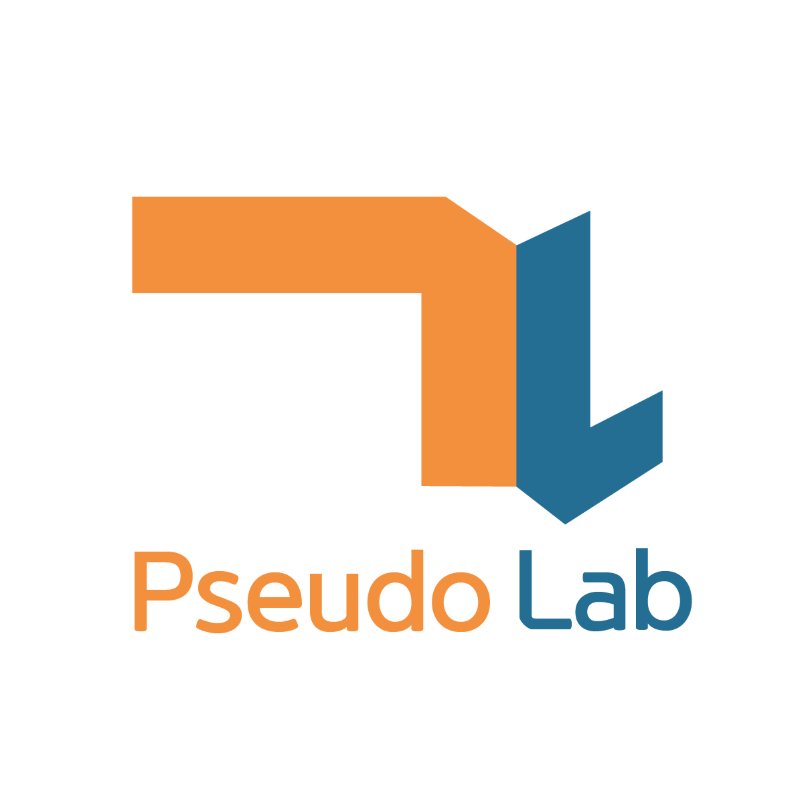

<style>
{
    font-size: 30px
}
</style>

# **cheese cRust** 
# 가짜연구소 Rust 3주차
구조체, 열거형, 패턴 매칭
 

---

# 구조체
- 여러 값의 묶음을 정의하는데 사용
- C/C++ Struct
- Python @dataclass
- 연관된 값을 가질 수 있는 측면에서는 튜플과 유사

---

## 구조체 정의


```rust
struct User {
    active: bool,
    username: String,
    email: String,
    sign_in_count: u64,
}
```

- struct 키워드로 이름 지정
- 중괄호 안에 필드라 부르는 각 구성 이름 및 타입 지정

---

## 구조체 인스턴스 생성

```rust
let user = User {
    active: true,
    username: String::from("someusername123"),
    email: String::from("someone@example.com"),
    sign_in_count: 1,
};

user.memail = String::from("anotheremail@example.com");
```

- 구조체 이름 작성 후 중괄호안에 필드 이름과 저장할 값 형태로 추가
- 순서는 동일하지 않아도 된다
- 점(.) 표기법으로 값을 얻어올 수 있다

---

## 필드 초기화 축약법 사용

```rust
fn build_user(email: String, username: String) -> User {
    User {
        active: true,
        username,
        email,
        sign_in_count: 1,
    }
}
```

- 변수명과 필드 이름이 같은 경우 그냥 넣으면 된다

---

## 기존 인스턴스로 새 인스턴스 만들기

```rust
let new_user = User {
    active: user.active,
    ..user
};
```

- 각 필드를 기존 인스턴스의 값을 하나하나 넣을 수도 있지만
- .. 문법으로 명시된 필드 외에는 기존 인스턴스를 활용할 수 있다

---

## 튜플 구조체를 사용하여 다른 타입 만들기

```rust
struct Color(i32, i32, i32);
struct Point(i32, i32, i32);
```

```rust
let black = Color(0, 0, 0);
let origin = Point(0, 0, 0);
```

- Rust는 튜플과 유사한 튜플 구조체도 지원
- 구조체 이름은 지어주나, 필드는 타입만 작성한 형태
- Color와 Point는 별게의 타입
- 기존 튜플과 다르게 타입이 같아도 상호 대입X

---

## 필드가 없는 유사 유닛 구조체

```rust
struct AlwaysEqual;
```

```rust
let subject = AlwaysEqual;
```

- 필드가 없는 구조체 정의도 가능
- () 타입과 비슷하게 동작하여 유사 유닛 구조체
- 필드없이 어떤 타입에 대한 trait 구현할 때 유용
- trait는 메서드 그룹, 인터페이스 같은 것 (추후 자세히 다룹니다)

---

# 메서드 문법

- 함수와 유사, 구조체 컨텍스트에 정의 
(열거형, trait 객체 안에 정의)

