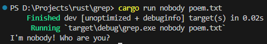

<style>
{
    font-size: 30px
}
</style>

# **cheese cRust** 
# 가짜연구소 Rust 5주차
에러처리, 제네릭
 

---

# 에러 처리
- 주로 복구 가능, 불가능 두가지 범주로 묶음

---

## panic!으로 복구 불가능한 에러 처리

- 코드가 직접 발생
- 개발자가 직접 panic! 호출
- 두 가지 방법으로 패닉 발생
- 발생 후 에러 메시지 출력, 스택 되감기(unwind)로 청소 후 종료

---

## 스택 되감기 

---

### panic! 직접 호출하기

```rust
fn main() {
    panic!("crash and burn");
}
```

---

```
thread 'main' panicked at 'Yee', src\main.rs:2:5
note: run with `RUST_BACKTRACE=1` environment variable to display a backtrace
error: process didn't exit successfully: `target\debug\example.exe` (exit code: 101)
```

- 위와 같은 에러 발생
- 어떤 코드의 라인에서 발생했는지 메시지 출력

---

### panic BACKTRACE 이용

```rust
fn main() {
    let v = vec![1, 2, 3];
    v[99];
}
```

- buffer overread 상황
- panic 발생

---

```
thread 'main' panicked at 'index out of bounds: the len is 3 but the index is 99', src\main.rs:3:5
note: run with `RUST_BACKTRACE=1` environment variable to display a backtrace
error: process didn't exit successfully: `target\debug\example.exe` (exit code: 101)
```

- 위와 같이 길이가 3인데 index가 99라는 에러 메시지 발생

---

```
stack backtrace:
   0: std::panicking::begin_panic_handler
             at /rustc/d5c2e9c342b358556da91d61ed4133f6f50fc0c3/library\std\src\panicking.rs:593 
   1: core::panicking::panic_fmt
             at /rustc/d5c2e9c342b358556da91d61ed4133f6f50fc0c3/library\core\src\panicking.rs:67 
   2: core::panicking::panic_bounds_check
             at /rustc/d5c2e9c342b358556da91d61ed4133f6f50fc0c3/library\core\src\panicking.rs:162
   3: core::slice::index::impl$2::index<i32>
             at /rustc/d5c2e9c342b358556da91d61ed4133f6f50fc0c3\library\core\src\slice\index.rs:261
   4: alloc::vec::impl$12::index<i32,usize,alloc::alloc::Global>
             at /rustc/d5c2e9c342b358556da91d61ed4133f6f50fc0c3\library\alloc\src\vec\mod.rs:2675
   5: example::main
             at .\src\main.rs:3
   6: core::ops::function::FnOnce::call_once<void (*)(),tuple$<> >
             at /rustc/d5c2e9c342b358556da91d61ed4133f6f50fc0c3\library\core\src\ops\function.rs:250
note: Some details are omitted, run with `RUST_BACKTRACE=full` for a verbose backtrace.
```
- RUST_BACKTRACE 환경 변수 0이 아니게 설정
- 위와 같이 stack backtrace를 얻을 수 있다
- 에러까지 콜스택

---

## Result로 복구 가능한 에러 처리

```rust
enum Result<T, E> {
    Ok(T),
    Err(E),
}
```

- Result 열거형
- T는 성공한 경우 Ok 배리언트 안에 반환될 값의 타입
- E는 실패한 경우 Err 배리언트 안에 반환될 타입
- **Result를 통하여 직접 에러를 처리**

---

```rust
let greeting_file = match File::open("hello.txt") {
        Ok(file) => file,
        Err(error) => panic!("Problem opening the file: {:?}", error),
};
```

- File::open은 Result<File, Error>를 반환
- match를 통하여 파일을 열었다면 file을 반환
- 여는데 실패하였다면 직접 panic 처리 또는 원하는 처리를 작성

---

```
Problem opening the file: Os { code: 2, kind: NotFound, message: "지정된 파일을 찾을 수 없습니다." }
```
- 실패시 위와 같이 panic!에 작성해둔 에러 메시지를 출력으로 볼 수 있다


---

## 서로 다른 에러에 대해 매칭

```rust
let greeting_file = match File::open("hello.txt") {
    Ok(file) => file,
    Err(error) => match error.kind() {
        ErrorKind::NotFound => match File::create("hello.txt") {
            Ok(fc) => fc,
            Err(e) => panic!("Problem creating the file: {:?}", e),
        },
        other_error => {
            panic!("Problem opening the file: {:?}", other_error);
        }
    },
};
```

- io::ErrorKind는 io 연산중 발생할 수 있는 다양한 에러의 열거형
- 파일을 여는데 못찾는 에러인 경우 파일을 생성하도록 처리
- 생성마저 실패하면 panic!
- 파일을 여는데 그 외의 에러인 경우 panic!

---

## unwrap_or_else로 match 덩어리 제거하기

```rust
let greeting_file = File::open("hello.txt").unwrap_or_else(|error| {
    if error.kind() == ErrorKind::NotFound {
        File::create("hello.txt").unwrap_or_else(|error| {
            panic!("Problem creating the file: {:?}", error);
        })
    } else {
        panic!("Problem opening the file: {:?}", error);
    }
});
```

- 성공시에는 File 객체를 반환
- error가 발생시 Result 객체를 받는 closure 를 활용하여 처리

---

## 패닉을 위한 Shortcut: unwrap

```rust
let greeting_file = File::open("hello.txt").unwrap();
```

- unwrap를 호출하는 경우 Result가 Ok라면 내부의 값을 반환
- Err이라면 panic! 자동 호출
- 직접 에러를 핸들링하지 않을 때 활용 가능

---

## 패닉을 위한 Shortcut: expect

```rust
let greeting_file = File::open("hello.txt")
        .expect("hello.txt should be included in this project");
```

- unwrap는 panic! 의 기본 메시지 출력
- expect를 사용하면 원하는 메시지를 출력할 수 있음
- 디버깅에 필요한 정보를 좀 더 담을 때 활용할 수 있다

---

## 에러 전파하기

```rust
fn read_username_from_file() -> Result<String, io::Error> {
    let username_file_result = File::open("hello.txt");

    let mut username_file = match username_file_result {
        Ok(file) => file,
        Err(e) => return Err(e),
    };

    let mut username = String::new();

    match username_file.read_to_string(&mut username) {
        Ok(_) => Ok(username),
        Err(e) => Err(e),
    }
}
```

- 위 함수와 같이 Result 객체를 반환하도록 작성
- 읽는데 성공하면 file의 문자열을 반환
- 실패하면 Error 객체를 반환하여 직접 처리
- 텍스트 파일을 읽는 과정을 하나로 묶은 함수

---

## 에러 전파를 위한 Shortcut: ?

```rust
fn read_username_from_file() -> Result<String, io::Error> {
    let mut username_file = File::open("hello.txt")?;
    let mut username = String::new();
    username_file.read_to_string(&mut username)?;
    Ok(username)
}
```

- ? 키워드는 match 표현시고가 거의 같은 방식
- Ok라면 안의 값을 얻음
- Err이라면 return 키워드로 에러 값을 반환
- match와 차이점은 from 함수를 거침 (from은 타입 변환 함수)

---

```rust
fn read_username_from_file() -> Result<String, io::Error> {
    fs::read_to_string("hello.txt")
}
```

- 파일 문자열 읽는 코드는 흔하게 사용되기에 표준 라이브러리에서 read_to_string 함수 제공

---

## ? 연산자가 사용될 수 있는 곳

```rust
fn main() {
    let greeting_file = File::open("hello.txt")?;
}
```

- 일단 위와 같은 main 에서는 사용 불가능!
- 반환 타입이 Result가 아니기 때문이다

---

```rust
fn last_char_of_first_line(text: &str) -> Option<char> {
    text.lines().next()?.chars().last()
}
```

- ? 사용된 값과 호환되는 반환 타입을 가진 함수에서만 사용 가능
- &str의 lines는 문자열에 대한 반복자 생성
- next를 호출하여 첫 번째 값을 얻어옴
- 이때 빈 문자인 경우 None을 반환하는데 ?를 이용하여 즉시 return

---

```rust
fn main() -> Result<(), Box<dyn Error>> {
    let greeting_file = File::open("hello.txt")?;
    Ok(())
}
```

- main에서는 위와 같이 사용할 수 있다
- BOX<dyn Error> 은 어떤 종류의 에러를 의미, 추후에 자세히 나옴

---

# 제네릭

- 중복되는 개념을 효율적으로 처리하기 위한 도구
- 구체 (concrete) 타입 혹은 기타 속성에 대한 추상화
- 이미 사용해본 Option<T>, Vec<T>, HashMap<K, V>, Result<T, E>

---

## 제네릭 데이터 타입

```rust
fn largest_i32(list: &[i32]) -> &i32 {
    let mut largest = &list[0];
    for item in list {
        if item > largest {
            largest = item;
        }
    }

    largest
}

fn largest_char(list: &[char]) -> &char {
    // largest_i32와 동일한 내용
}
```

- 위와 같이 타입만 다르고 동일한 구현을 가진 함수가 있는 경우
- 배열에서 가장 높은 값을 가져오는 함수
- 제네릭으로 하나로 만들 수 있다

---

```rust
fn largest<T>(list: &[T]) -> &T {
    let mut largest = &list[0];
    for item in list {
        if item > largest {
            largest = item;
        }
    }

    largest
}
```

- 함수명과 매개변수 사이 꺾쇠괄호(<>)에 매개변수 타입 이름 선언
- 어떤 타입 T에 대한 제네릭 함수
- 아직은 컴파일이 되지 않는다
- std::cmp::ParialOrd 트레이트가 에러에 언급
- **T가 될 수 있는 모든 타입에서 동작할 수 없어 에러 발생**
- 트레이트에서 추가로 알아볼 예정

---

## 제네릭 구조체 정의

```rust
struct Point<T> {
    x: T,
    y: T,
}
```

```rust
let integer = Point { x: 5, y: 10 };
let float = Point { x: 1.0, y: 4.0 };
```

- <> 문법으로 구제체 필드에서 제네릭 타입 매개변수를 사용하도록 정의

---

```rust
let wont_work = Point { x: 5, y: 4.0 };
```

- 서로 다른 타입을 넣으면 에러 발생
- 이미 Point<T>는 정수 타입으로 인지했기 때문

---

```rust
struct Point<T, U> {
    x: T,
    y: U,
}
```

- 두 개의 제네릭 타입을 이용하여 서로 다른 타입의 구조체도 가능
- 원하는 만큼 정의 가능, 단 가독성은 최악이 됨

---

## 제네릭 열거형 정의

```rust
enum Option<T> {
    Some(T),
    None,
}
```

- 기본 내장된 Option<T>는 T타입에 대한 제네릭 열거형
- T 타입의 값을 가진 Some와 아무것도 가지지 않은 None 배리언트를 가짐
- 위와 같이 작성되어 있기에 **어떤 타입이든 사용할 수 있다**

---

## 제네릭 메서드 정의

```rust
impl<T> Point<T> {
    fn x(&self) -> &T {
        &self.x
    }
}
```

- impl 뒤에도 T를 선언, Point<T> 타입에 대한 메서드 구현 명시
- impl 뒤에 T를 선언하지 않으면 현재 스코프에서 T를 알 수 없음 에러

---

## 제네릭 코드의 성능

```rust
let integer = Some(5);
let float = Some(5.0);
```

- 런타임 비용은 증가하지 않음
- 컴파일 중 단형성화를 수행
- 위 코드는 i32와 f64 타입에 대한 단형성화를 수행한다

---

```rust
enum Option_i32 {
    Some(i32),
    None,
}

enum Option_f64 {
    Some(f64),
    None,
}
```

- 컴파일 중 위 예시와 같이 i32, f64 에 특성화 시킨 정의로 확장
- 실제 코드는 위와 다름...
- **컴파일 시간이 증가될 수 있다**
- **코드가 늘어난 만큼 실행 파일도 커질 수 있다**

---

# 5주차 미션

---



- 12.I/O프로젝트: 커멘드 라인 프로그램 만들기의 12.1, 12.2를 작업
- 작업 후 query의 단어가 들어간 라인만 출력하도록 간단한 grep 만들기
- query 수행한 부분 코드와 출력 결과를 스크린샷에 포함시켜 공유

**(필수 미션)**
