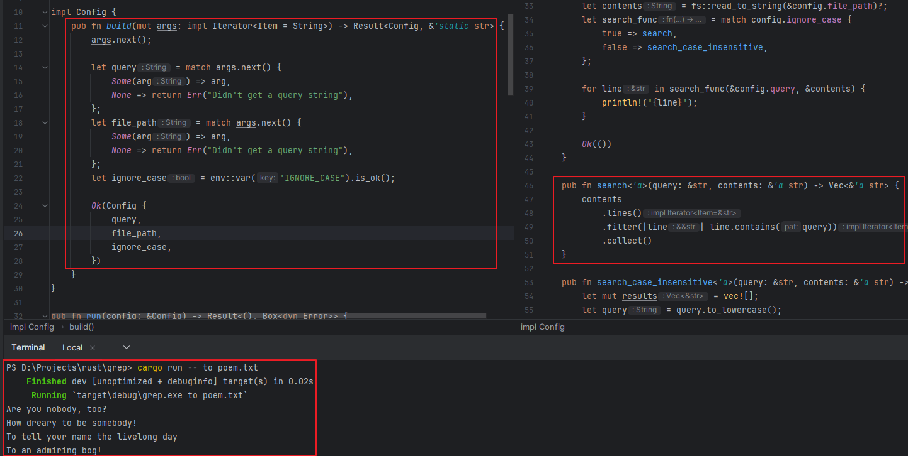
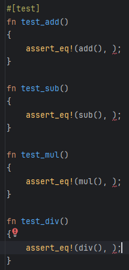

<style>
{
    font-size: 30px
}
</style>

# **cheese cRust** 
# 가짜연구소 Rust 7주차
test 작성
 

---

# 자동화 테스트 작성하기

- **러스트는 자체적인 자동화된 소프트웨어 테스트 작성을 지원**
- python의 경우 내장된 unittest 또는 pytest를 사용함
- C/C++는 MS, Goolge, Boost 등에서 제공하는 테스트 프레임워크가 있음

---

## 테스트 작성 방법

- 테스트할 코드가 의도대로 동작하는지 검증하는 함수
1. 필요한 데이터나 상태 설정
2. 테스트할 코드 실행
3. 의도한 결과가 나오는지 확인

---

## 테스트 함수 파헤치기

```rust
#[cfg(test)]
mod tests {
    #[test]
    fn it_works() {
        let result = 2 + 2;
        assert_eq!(result, 4);
    }
}
```

- Rust의 테스트는 test 속성이 어노테이션된 함수
- fn 이전줄에 #[test]를 추가하면 테스트 함수로 변경
- cargo test 명령어로 테스트 실행 바이너리를 빌드 및 실행
- assert로 2+2 결과가 4인지 검사

---

```
PS D:\Projects\rust\presenter_picker\adder> cargo test
    Finished test [unoptimized + debuginfo] target(s) in 0.02s                  
     Running unittests src\lib.rs (target\debug\deps\adder-c4244062c19f4c41.exe)

running 1 test                                                                               
test tests::it_works ... ok                                                                  
                                                                                             
test result: ok. 1 passed; 0 failed; 0 ignored; 0 measured; 0 filtered out; finished in 0.00s

   Doc-tests adder
```

- 실행하면 테스트 수행 결과에 대한 로그가 나옴

---

```rust
#[test]    
fn another() {
    panic!("Make this test fail");    
}
```

```
test result: FAILED. 1 passed; 1 failed; 0 ignored; 0 measured; 0 filtered out; finished in 0.14s
```

- 실패하는 테스트 추가, FAILED 1이 된 것을 볼 수 있음

---

## assert! 매크로로 결과 검사

```rust
#[test]
fn test_compare() {
    let a = "AAA";
    let b = "AAA";
    assert!(a == b);
}
```

- assert! 는 bool 값을 받아서 검사를 진행
- true 면 성공

---

## assert_eq! 

```rust
#[test]
fn test_compare() {
    let a = "AAA";
    let b = "AAA";
    assert_eq!(a, b);
}
```

- 두 인자가 같은지 검사

---

## assert_ne! 

```rust
#[test]
fn test_compare() {
    let a = "AAA";
    let b = "AAA";
    assert_eq!(a, b);
}
```

- 두 인자가 다른지 검사

---

## 커스텀 실패 메시지 추가

```rust
#[test]
fn test_compare() {
    let a = "AAA";
    let b = "BBB";
    assert!(a == b, "{a} and {b} not equal" );
}
```

```
---- tests::test_compare2 stdout ----
thread 'tests::test_compare2' panicked at 'AAA and BBB not equal', src\main.rs:18:9
```

- assert! 두번째 인자로 format!을 넣을 수 있고 실패시 위와 같이 stdout으로 직접 작성한 메시지가 출력됨

---

## should_panic 속성

```rust
#[test]
#[should_panic]
fn test_panic() {
    panic!("Should panic!");
}
```

- 테스트에서 panic! 발생을 체크

---

## Result<T, E>를 이용한 테스트

```rust 
#[test]
fn it_works() -> Result<(), String> {
    if 2 + 1 == 4 {
        Ok(())
    } else {
        Err(String::from("two plus two does not equal four"))
    }
}
```

```
---- tests::it_works stdout ----
Error: "two plus two does not equal four"
```

- 테스트 성공시에는 Ok() 를 반환
- 테스트 실패시에 Err(String)을 반환 후 테스트 실패 처리됨
- stdout에는 Err 안에 있는 String을 출력

---

## 테스트 실행 방법 제어

- -- 구분자를 쓰고 그 뒤에 테스트 바이너리에 전달할 인자를 작성
- **cargo test --help** : test 명령에 사용 가능한 옵션 표기
- **cargo test -- --help** : -- 구분자 이후 사용 가능한 옵션 표기

---

## 테스트를 병렬 혹은 순차적으로 실행하기

- 기본적으로 테스트는 병렬로 수행됨
- 동일한 파일에 대한 테스트를 예로 들면 병렬인 경우 실패의 가능성이 있음
- cargo test -- --test-threads=1 
- 위 명령어로 스레드 하나에서 테스트를 진행하면 순차적으로 수행됨

---

- --show-output 옵션을 통하여 성공한 테스트의 출력도 볼 수 있다

```rust
#[test]
fn exploration() {
    println!("Success Test");
    assert_eq!(2 + 2, 4);
}
```

```
---- tests::exploration stdout ----
Success Test
```

---

## 명령어로 특정 테스트만 수행

- cargo test [테스트 이름] 으로 특정 테스트만 수행할 수 있다
- 첫 번째 인자의 테스트만 수행이되고 여러 테스트 수행은 불가능

--- 

## 필터를 통한 여러 테스트 수행

- cargo test [테스트 이름에 포함되는 문자열]
- 위 방법으로 테스트 이름에 문자열이 포함되는 여러 테스트 수행이 가능하다 
- add의 경우 add_test, test_add, testadd, addtest 라는 이름의 테스트가 있는 경우 전부 수행

---

## ignore로 특정 테스트 무시

```rust
#[test]
#[ignore]
fn exploration() {
    assert_eq!(2 + 2, 4);
}
```

- ignore 속성을 추가하여 테스트에서 제외할 수 있다
- cargo run -- --ignored 명령어를 입력하면 무시한 테스트만 수행 가능
- 모든 테스트를 수행하고 싶으면 --include ignored

---

## 테스트 조직화

- 러스트 커뮤니티에서는 크게 유닛 테스트, 통합 테스트로 나눔
- 유닛 테스트는 작고 집중적, 라이브러리, 함수 단위 
- 통합 테스트는 라이브러리 외부에서 여러 모듈을 포함한 테스트

---

## 유닛 테스트

```rust
pub fn add(a: usize, b: usize) { a + b }

#[cfg(test)]
mod tests {
    use super::*;

    #[test]
    fn it_work() { 
        assert_eq!(add(2, 2), 4);
    }
}
```

- 각 코드 단위를 나머지 코드와 분리하여 제대로 동작하지 않는 코드가 어느 부분인지 빠르게 파악
- 각 파일에 tests 모듈을 만들고 cfg(test)를 어노테이션 하는게 일반적인 관례
- 일반 코드와 같은 위치에 포함


---

```rust
fn internal_add(a: usize, b: usize) { a + b }

#[cfg(test)]
mod tests {
    use super::*;

    #[test]
    fn it_work() { 
        assert_eq!(internal_add(2, 2), 4);
    }
}
```

- pub가 아닌 비공개 함수도 테스트 가능

---

## 통합 테스트

```
adder
├── Cargo.lock 
├── Cargo.toml 
├── src 
│   └── lib.rs 
└── tests    
    └── integration_test.rs
```

- src 폴더 옆에 tests 폴더를 생성
- cargo test는 프로젝트 하위의 모든 tests 폴더의 테스트 코드를 수행


---

integration_test.rs

```rust
use adder;
#[test]
fn it_adds_two() {
    assert_eq!(4, adder::add_two(2));
}
```
- #[cfg(test)] 없이 동작

---

## 통합 테스트 내 서브 모듈

```
adder
└── tests    
    └── common.rs
```

```rust
pub fn setup() { ... }
```

```
Running tests\common.rs (target\debug\deps\common-417a720530eed599.exe)
```

- 위와 같이 common.rs를 추가하고 setup에서 테스트에 필요한 옵션들을 설정하고 싶은 상황
- 하지만 위 상태로 cargo test를 돌리면 common 모듈 테스트를 수행함
- 원하는 결과는 아니다

---

```
adder
└── tests    
    └── common
        └── mod.rs
```

- 위와 같이 이전 명명 규칙을 통해서 모듈을 선언
- 테스트 대상이 되지 않음

---

## 바이너리 크레이트에서 테스트

- tests에서 main.rs의 모듈은 가져올 수 없음
- 그래서 바이너리 제공 프로젝트는 main은 간단하게 작성
- lib.rs에서 주로 작성

---

## 기능 테스트 vs 비기능 테스트

| 기능 테스트 | 비기능 테스트 |
|------------|--------------|
| 기능 중심의 테스트 | 요구사항 중심적 테스트 |
| 단위, 통합 테스트 등 | 성능, 스트레스, 보안 테스트 등 |

- 기능 테스트는 코드 위주의 기능 테스트
- 비기능 테스트는 실제 서비스 등 다양한 상황에 대한 테스트

---

# 7주차 미션

---

 

- 13.3 I/O 프로젝트 개선하기 진행 후 개선 코드를 포함한 출력 결과 스샷
- a와 b에 대한 사칙 연산에 대한 함수를 만들고 테스트 코드 스샷
